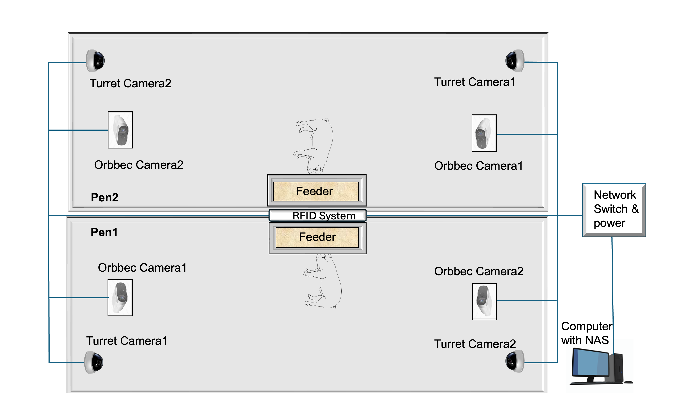

# Viewpoint-Aware Pig Posture Recognition

This repository contains the code for **Viewpoint-Aware Pig Posture Recognition and Benchmark Dataset** paper accepted in CV4Animals 2026. The system estimates per-camera viewing angles (azimuth and elevation) using PnP-based camera calibration and feeds those angles as conditioning signals into a DINOv2-based posture classifier.

> **Dataset:** [viewpoint-aware-pig-posture-recognition](https://huggingface.co/datasets/anilbhujel/viewpoint-aware-pig-posture-recognition) on HuggingFace

---

## Overview

Posture recognition in overhead livestock cameras is challenging because the same posture looks different depending on camera position. This project addresses the problem by:

1. **Calibrating each camera extrinsic parameters** from a calibrated intrinsic parameters and single reference image using interactive corner annotation and PnP homography estimation.
2. **Computing per-instance viewpoint angles** (azimuth + elevation) from the calibrated camera parameters and bounding-box positions.
3. **Training a DINOv2 classifier** conditioned on these angles so that the model is robust across both seen and unseen viewpoints.

> For posture class definitions, CSV column descriptions, camera setup, and viewpoint angle convention, see the [HuggingFace dataset page](https://huggingface.co/datasets/anilbhujel/viewpoint-aware-pig-posture-recognition).

### Camera Setup



### Results

| Test Set | Accuracy | Macro F1 |
|----------|----------|----------|
| Seen viewpoints | 92.51 % | 87.95 % |
| Unseen viewpoints | 91.07 % | 86.12 % |

---

## Repository Structure

```
code/
├── camera_angle_estimation/          # Camera calibration & angle computation
│   ├── annotate_corners.py           # Interactive tool to click pen-floor corners
│   ├── pipeline_calib.py             # PnP camera-pose estimation from 4 corners
│   ├── generate_pnp_configs.py       # Build multi-camera JSON config from PnP results
│   ├── add_camera_angles_from_calib_multicam.py  # Annotate CSV rows with az/el angles
│   ├── compute_angle_map.py          # Dense per-pixel angle maps (visualisation)
│   ├── visualize_viewpoint_angles.py # Overlay arrow annotations on crops/images
│   ├── camera_configs/               # Pre-built camera config JSONs (zenith convention)
│   │   └── zenith/
│   │       ├── pen1_camera_config_pnp_zenith.json
│   │       └── pen2_camera_config_pnp_zenith.json
│   ├── gt_camera_parameters/         # Intrinsics: .npz (fisheye) and .ini (pinhole)
│   └── results/zenith/               # PnP output camera_params.json per camera
│
├── dino_angles_domain/               # DINOv2 training & evaluation
│   ├── dino_train.py                 # Main training script (all hyperparameter flags)
│   ├── dino_evaluation.py            # Standalone evaluation with optional TTA
│   ├── dino_model.py                 # DinoHead, DinoAngleMlpHead, GRL domain head
│   ├── dataset.py                    # PigCropDataset with angle-aware augmentation
│   ├── losses.py                     # FocalLoss + class-weighting helpers
│   ├── evaluate.py                   # F1, confusion matrix, TTA prediction helpers
│   └── utils.py                      # Seeds, bbox helpers, camera-ID parsing
│
├── checkpoint/
│   └── best_dino_angle_domain_model.pt   # Pre-trained checkpoint
│
└── results/
    ├── eval_seen/                    # Evaluation outputs on seen-viewpoint test set
    └── eval_unseen/                  # Evaluation outputs on unseen-viewpoint test set
```

---

## Setup

### Requirements

Python ≥ 3.10 and PyTorch ≥ 2.0 are required.

**1. Create and activate an environment** (`vap_env` = Viewpoint-Aware Posture Env):

```bash
# Using conda (recommended)
conda create -n vap_env python=3.10 -y
conda activate vap_env

# Or using venv
python3.10 -m venv vap_env
source vap_env/bin/activate   # Linux / macOS
# vap_env\Scripts\activate.bat    # Windows
```

**2. Install PyTorch** with the CUDA version matching your system (see [pytorch.org](https://pytorch.org/get-started/locally/)):

```bash
# Example for CUDA 12.1 (tested)
pip install torch torchvision --index-url https://download.pytorch.org/whl/cu121
```

**3. Install remaining dependencies:**

```bash
pip install -r requirements.txt
```

All required packages are listed in [`requirements.txt`](requirements.txt).

### Clone

```bash
git clone https://github.com/Anil-Bhujel/viewpoint-aware-pig-posture-recognition.git
cd viewpoint-aware-pig-posture-recognition
```

---

## Step-by-Step Reproduction

### Step 1 — Download the Dataset

Download the dataset from HuggingFace:

```bash
pip install huggingface_hub
python - <<'EOF'
from huggingface_hub import snapshot_download
snapshot_download(
    repo_id="anilbhujel/viewpoint-aware-pig-posture-recognition",
    repo_type="dataset",
    local_dir="dataset"
)
EOF
```

The dataset will be placed in `dataset/multiview_pig_posture_recognition/`.

---

### Step 2 — (Optional) Re-calibrate Cameras

Pre-computed camera parameters and angle-annotated CSVs are already included in the dataset. Skip to Step 3 if you want to use them directly. Follow this step only if you are adding new cameras or new environments.

#### 2a. Annotate pen-floor corners (optional pre-step)

`pipeline_calib.py` needs 4 pen-floor corner points. You have two options:

**Option A — annotate corners separately first**, then pass the saved JSON to `pipeline_calib.py`.  
This is useful when you want to reuse the same corners across multiple runs or reference frames.

```bash
cd code/camera_angle_estimation

python annotate_corners.py \
    --image /path/to/reference_frame.jpg \
    --out   results/zenith/pen1_tur_cam1/corners.json
```

Click corners in order: `p1 near-left → p2 near-right → p3 far-right → p4 far-left`.  
Controls: left-click to place, right-click to undo, `Enter` to save.

**Option B — annotate interactively inside `pipeline_calib.py`** (no separate step needed).  
If `--corners` is omitted, `pipeline_calib.py` opens an interactive window and runs corner annotation internally, then immediately proceeds with PnP estimation.

#### 2b. Estimate camera pose (PnP)

**With pre-saved corners (Option A):**

```bash
python pipeline_calib.py \
    --image   /path/to/reference_frame.jpg \
    --calib   gt_camera_parameters/pen1_tur_cam1_calibration.npz \
    --corners results/zenith/pen1_tur_cam1/corners.json \
    --out-dir results/zenith/pen1_tur_cam1
```

**Without pre-saved corners — annotate on the fly (Option B):**

```bash
python pipeline_calib.py \
    --image   /path/to/reference_frame.jpg \
    --calib   gt_camera_parameters/pen1_tur_cam1_calibration.npz \
    --out-dir results/zenith/pen1_tur_cam1
```

In both cases the script outputs `camera_params.json` with `K`, `R`, `tvec`, `cam_pos`, and floor dimensions. The annotated corners are also saved to `--out-dir/corners.json` for future reuse.

For Orbbec (pinhole) cameras, add `--no-fisheye` and use the `.ini` calibration file:

```bash
python pipeline_calib.py \
    --image   /path/to/reference_frame.jpg \
    --calib   gt_camera_parameters/p1c1_orb.ini \
    --no-fisheye \
    --out-dir results/zenith/pen1_orb_cam1
```

#### 2c. Build multi-camera config

```bash
python generate_pnp_configs.py \
    --output-dir camera_configs/zenith \
    --output-name pen1_config \
    --elevation-convention zenith \
    --camera-params \
        pen1_tur_cam1:fisheye:gt_camera_parameters/pen1_tur_cam1_calibration.npz:results/zenith/pen1_tur_cam1/camera_params.json \
        pen1_tur_cam2:fisheye:gt_camera_parameters/pen1_tur_cam2_calibration.npz:results/zenith/pen1_tur_cam2/camera_params.json \
        pen1_orb_cam1:pinhole:gt_camera_parameters/p1c1_orb.ini:results/zenith/pen1_orb_cam1/camera_params.json \
        pen1_orb_cam2:pinhole:gt_camera_parameters/p1c2_orb.ini:results/zenith/pen1_orb_cam2/camera_params.json
```

#### 2d. Annotate dataset CSV with angles

```bash
python add_camera_angles_from_calib_multicam.py \
    --csv           ../../dataset/multiview_pig_posture_recognition/train.csv \
    --out-csv       ../../dataset/multiview_pig_posture_recognition/train_with_angles.csv \
    --camera-config camera_configs/zenith/pen1_camera_config_pnp_zenith.json \
                    camera_configs/zenith/pen2_camera_config_pnp_zenith.json \
    --sample-mode   center \
    --elevation-convention zenith
```

This adds columns `azimuth_sin`, `azimuth_cos`, `elevation_sin`, `elevation_cos`, `angle_valid`, and `cam_pos_source` to the CSV.

---

### Step 3 — Train the Posture Classifier

The training script is `dino_angles_domain/dino_train.py`. Run from the `dino_angles_domain/` directory (or adjust paths accordingly).

#### Baseline (no angle conditioning)

```bash
cd code/dino_angles_domain

python dino_train.py \
    --data-root   ../../dataset/multiview_pig_posture_recognition \
    --train-csv   train.csv \
    --test-csv    unseenVP_test.csv \
    --test-images unseenVP_test_images \
    --seen-test-csv   seenVP_test.csv \
    --seen-test-images seenVP_test_images \
    --dino-weight facebook/dinov2-base \
    --head mlp \
    --img-size 224 \
    --batch 64 \
    --epochs 30 \
    --lr 1e-4 \
    --wd 0.05 \
    --out-dir runs/baseline \
    --use-amp
```

#### With angle conditioning

```bash
python dino_train.py \
    --data-root   ../../dataset/multiview_pig_posture_recognition \
    --train-csv   train.csv \
    --test-csv    unseenVP_test.csv \
    --test-images unseenVP_test_images \
    --seen-test-csv   seenVP_test.csv \
    --seen-test-images seenVP_test_images \
    --dino-weight facebook/dinov2-base \
    --head mlp \
    --use-angles \
    --angle-mlp-dim 128 \
    --shared-hidden-dim 128 \
    --img-size 224 \
    --batch 64 \
    --epochs 30 \
    --lr 1e-4 \
    --wd 0.05 \
    --hflip-prob 0.5 \
    --vflip-prob 0.3 \
    --flip-swap-map '{"0":"1","1":"0"}' \
    --mixup-cutmix-prob 0.7 \
    --out-dir runs/angle_conditioned \
    --use-amp
```

#### With angle conditioning + domain adversarial training

```bash
python dino_train.py \
    --data-root   ../../dataset/multiview_pig_posture_recognition \
    --train-csv   train.csv \
    --test-csv    unseenVP_test.csv \
    --test-images unseenVP_test_images \
    --seen-test-csv   seenVP_test.csv \
    --seen-test-images seenVP_test_images \
    --dino-weight facebook/dinov2-base \
    --head mlp \
    --use-angles \
    --use-domain-adv \
    --grl-lambda 0.1 \
    --w-domain 0.05 \
    --angle-mlp-dim 128 \
    --shared-hidden-dim 128 \
    --img-size 224 \
    --batch 64 \
    --epochs 30 \
    --lr 1e-4 \
    --wd 0.05 \
    --out-dir runs/angle_domain_adv \
    --use-amp
```

**Key training flags:**

| Flag | Description |
|------|-------------|
| `--use-angles` | Concatenate (az_sin, az_cos, el_sin, el_cos) with DINOv2 CLS token |
| `--use-domain-adv` | Enable gradient-reversal domain adversarial branch |
| `--grl-lambda` | Reversal strength for domain confusion |
| `--finetune-backbone` | Fine-tune the DINOv2 backbone (default: frozen) |
| `--tta` | [Optional] Horizontal flip TTA at test time (Not used in our results)|
| `--tta-multi` | 4-view TTA (original + hflip + vflip + rot180) |
| `--hflip-prob` | Horizontal flip augmentation probability |
| `--vflip-prob` | Vertical flip augmentation probability |
| `--flip-swap-map` | JSON map swapping left/right class labels on flip (e.g. `{"0":"1","1":"0"}`) |

---

### Step 4 — Evaluate a Checkpoint

```bash
cd code/dino_angles_domain

python dino_evaluation.py \
    --data-root   ../../dataset/multiview_pig_posture_recognition \
    --test-csv    unseenVP_test.csv \
    --test-images unseenVP_test_images \
    --ckpt        ../checkpoint/best_dino_angle_domain_model.pt \
    --dino-weight facebook/dinov2-base \
    --head mlp \
    --use-angles \
    --img-size 224 \
    --batch 64 \
    --tta \
    --run-tag Dino_eval \
    --device cuda
```

Outputs saved to `--out-dir` (default `runs/eval`):
- `Dino_eval_classification_report.txt` — per-class precision / recall / F1
- `Dino_eval_confusion_matrix.csv` — confusion matrix
- `Dino_eval_confusion_matrix_norm.png` — normalised confusion matrix plot
- `Dino_eval_predictions.csv` — per-instance predictions

---

### Step 5 — (Optional) Visualise Viewpoint Angles

Overlay arrows showing azimuth direction and elevation magnitude on cropped pig images:

```bash
cd code/camera_angle_estimation

python visualize_viewpoint_angles.py \
    --image-dir ../../dataset/multiview_pig_posture_recognition/train_images \
    --csv       ../../dataset/multiview_pig_posture_recognition/train.csv \
    --output-dir /tmp/angle_vis \
    --crop \
    --arrow-scale 100
```

---

## Citation

If you use this code or dataset, please cite our work:

```bibtex
@inproceedings{CV4Animals2026,
  title     = {Viewpoint-Aware Pig Posture Recognition and Benchmark Dataset},
  author    = {Bhujel, Anil, Bashar, Mk and Morris, Daniel},
  year      = {2026}
}
```

---

## License

This project is released under the [MIT License](LICENSE).
